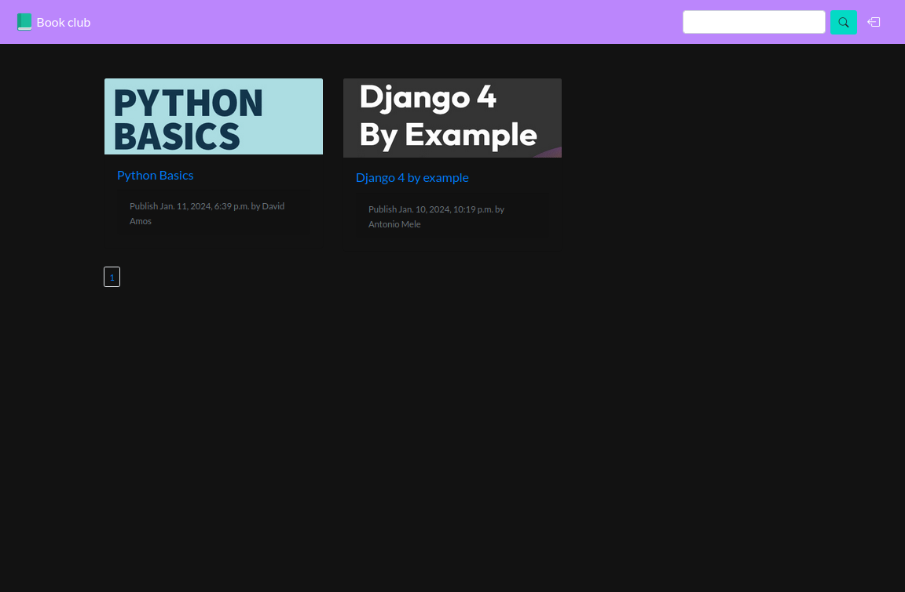

# book-club
Explore the world of Django development in "Django Unveiled," a concise yet comprehensive guide to building dynamic web applications. This project covers key functionalities:
- **GitHub Authentication**
Learn to implement secure GitHub authentication for seamless user logins, enhancing both security and user experience.
- **Full-Text Search**
Master the art of efficient full-text search, enabling users to quickly find relevant content within your application.
- **Interactive Comments**
Elevate user engagement with a dynamic commenting system, fostering community interaction and discussions.
- **CKEditor Integration**
Integrate CKEditor to empower content creators with an easy-to-use editor for crafting detailed and visually appealing pages.

## Home page

## Detail page

## SignIn page

## Usage
`git clone https://github.com/snomfake/book-club/ && cd book-club`
`docker-compose build`
`docker-compose run --rm book-club sh -c "./manage.py migrate"`
`docker-compose up`
